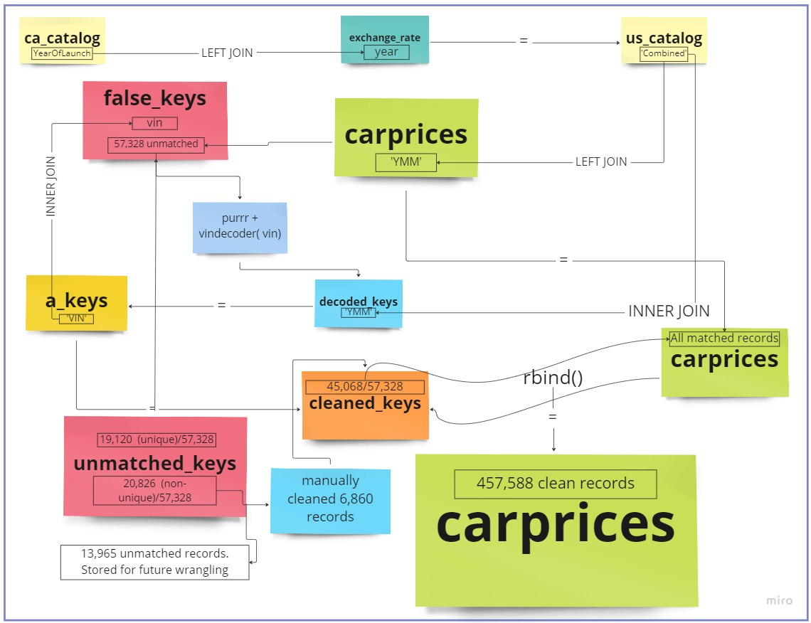

```{r}
#| label: setup
#| warning: false
library(distill)
library(tidyverse)
library(tidyr)
library(summarytools)
library(dplyr)
library(readr)
library(readxl)
library(stringr)
library(lubridate)
library(vindecodr)
library(plotrix)
library(sparklyr)
library(purrr)
library(rmarkdown)
library(knitr)
library(psych) 


knitr::opts_chunk$set(echo = TRUE, warning = FALSE, paged.print= TRUE)


```

# **Introduction**

Introduction & Purpose of the Study:

The automotive sector is a major part of the US economy and is among the hardest hit by the ripple effects of the COVID-19 pandemic. Factory closures and lockdowns led to a supply shortage of critical vehicle components necessary for new car production. Consequently, this has significantly increased the demand and value of used cars. However, some experts believe the market will return to 'normal' by the end of 2023. But what did the market look like before the pandemic?

The purpose of this study is to explore the realm of the used car market, specifically, the wholesale sector. The primary data was gathered from a public domain and represents Manheim auction sales between wholesalers/ remarketers and wholesale buyers/ dealers of used vehicles. I am interested in exploring the retained value of vehicles based on their segment, body type, and age. Correlations between vehicle condition and mileage will also be analyzed.

Research Question: How do age, mileage, body style, and condition affect the retained value of a used vehicle?

# **Data & Methodology:**

#### Reading in the Data

```{r Read In, message=FALSE, warning=FALSE}
# # #RStudio Desktop
carprices <-read_excel("_data/car_prices2.xlsx", col_types = c("text", "text", "text", "text", "text", "text", "text", "text", "numeric", "numeric", "text", "text", 
        "text", "numeric", "numeric", "text",  "skip"))
df <- carprices
exchange_rate <- read_excel("_data/Historical_Prices.xlsx", col_types = c("numeric", "text", "skip", "skip", "skip", "numeric"))

#Second Read-In of ca_catalog (to make data fields private)
ca_catalog <- read_csv("_data/ca_catalog2.csv")

#Read-In from code chunk
decoded_keys <- read_csv("_data/decoded.keys1.csv")
```

```{r Cloud Read In, message=FALSE, warning=FALSE, include=FALSE}
# # # #RStudio Cloud
#  carprices <-read_csv("/cloud/project/Final_project/car_prices.csv",
#      col_types = cols(mmr = col_number(), year = col_character(), sellingprice = col_number(), ...17 = col_skip()))
#   ca_catalog <- read_csv("/cloud/project/Final_project/ca_catalog.csv")
#  exchange_rate <- read_excel("/cloud/project/Final_project/HistoricalPrices.xlsx",  col_types = c("numeric", "text", "skip", "skip", "skip", "numeric"))
```

**Description of Data:**

The primary data used in the analysis was the 'carprices.csv' data set from Kaggle (see appendix A). This data set contains historical used vehicle auction transactions that took place between 2014 and 2015. The data was collected from Manheim auction houses across the 34 states in the USA. Each observation details a wholesale auction transaction that includes: the vehicle information, state/province, selling price, sale date, and the market average price i.e., the Manheim Market Report price (MMR) and other specifics about the sale.

#### 

#### **Primary Objectives**

*Data Cleansing:*

1.  Have consistency in the names of vehicle makes and models by using appropriate packages and joins.

2.  Obtain MSRP from by joining with a catalog

*Data Analysis:*

3.  Calculate vehicle age as a variable in both years and months.

4.  Compute retained value as a percentage of each vehicle's MSRP

5.  Compute standard error as a percentage of the mean MSRP for each model and filter transactions with a low error rating for deeper analysis.

6.  Analyze the impact of age, mileage, condition, and segment on retained value

7.  Determine the segments (eg. compact cars, midsize cars, etc.) and vehicles with the highest retained value percentage.\

#### **Methods:**

Retained Value (RV) is calculated by dividing the selling price (auction value) by the vehicle's MSRP.

Retained Value% = Wholesale Price/ MSRP 

I was able to source MSRPs from a Canadian vehicle catalog *(Appendix B)* . To protect the data confidentiality, the MSRPs in the Canadian dollar catalog were averaged for each year, make, and model by trim level. In other words, I aggregated and derived the mean of the MSRPs of all trims belonging to a specific year, make and model, or YMM to reduce the level of detail. Therefore, MSRPs for trims belonging to a particular year, make and model shows the mean MSRP for the entire YMM group. 

{fig-align="center"}

Using the YMM as a key common to the 'carprices' data as well as the ca_catalog, I can combine both and fetch the MSRP. Unsurprisingly, this left one more challenge, the MSRPs are listed in Canadian Dollars. In order to convert it to US Dollars, I will have to find and divide each vehicle MSRP by the USD: CAD exchange rate at the time of release. I was able to source the FX rate from 2006 and onwards using 'exchange_rate.csv' data obtained from WSJ Markets. Considering the below assumptions, I joined the exchange_rate.csv to carprices.csv using launch year as the common key between both data frames. Each MSRP was then divided by the daily close rate of the USD-CAD. 

Important assumptions to get MSRP in USD: 

1.  Canadian vehicles & trims are priced similarly with US trims. 

2.  All vehicles were released in September of the previous year. i.e., a 2013 vehicle was available for sale in September 2012. 

3.  The exchange rate at the time of release was the closing FX rate at Aug-31st 

#### **Data Cleansing:**

##### **Observing the data**

```{r results='hide'}
summary(df)
```

Table 1.0: Auction Data (Preview)

```{r Intro, message=FALSE, warning=FALSE, echo= TRUE}
print(kable(head(carprices)))
```

```{r message=FALSE, warning=FALSE, echo= TRUE, results='hide'}
#Observing and removing all records for model year 2006 and older & all erroneous prices
carprices<- carprices %>% filter(`year`> 2006, sellingprice>100)

#Checking the consistency in the names of states and body types
carprices %>%  select(state) %>% distinct()
carprices %>% select(body) %>% distinct() 

carprices$state <- toupper(carprices$state)
carprices$body <- toupper(carprices$body)
```

##### Cleaning the Data: Mapping and Joining

```{r message=FALSE, warning=FALSE, echo=TRUE, results='hide'}

#Checking the consistency in the names of Body types}
carprices %>% select(body) %>% unique()

#Creating a Body Type column
carprices <- mutate(carprices, Body_Type = case_when(str_detect(body, "EDAN")~ "Sedan", str_detect(body, "SUV") ~ "SUV", str_detect(body, "AB") ~ "Pickup", str_detect(body, "OUP")~ "Coupe", str_detect(`body`, "VAN")~ "Minivan", str_detect(`body`,"ONV")~ "Convertible", str_detect(`body`,"AGO") ~ "Wagon", str_detect(`body`,"ATCH")~ "Hatchback", str_detect(`body`,"CREW")~ "Pickup" ))

```

Joining multiple files to get the MSRP from a historical catalog. The code below shows what I did to write a new CSV file (that does not include the original MSRP but rather the mean MSRP and the other useful fields like trim count and Error.

```{r Creating a Join key, message=FALSE, warning=FALSE, eval=FALSE}

#Creating a Key in the CDN catalog
ca_catalog <-  ca_catalog %>% mutate(YearOfLaunch= `Model Year`-1)

#Creating Catalog with MSRP in CAD
ca_catalog <- ca_catalog %>% group_by(`Combined`, `YearOfLaunch`, `Segment` ) %>% 
summarise( Trim_Count=n(), AVG_MSRP_CAD= mean(`MSRP`, na.rm= TRUE), MSRP_Range_CAD= (max(`MSRP`)- min(`MSRP`)), StdDev_MSRP_CAD= sd(`MSRP`, na.rm=FALSE), Error.MSRP_CAD= std.error(`MSRP`, na.rm=FALSE))%>% 
ungroup()

#Writing CSV to exclude confidential MSRPs and only include the AVG_MSRP field
write.csv(ca_catalog, "C:\\Users\\Owen-Matthew\\Documents\\Github\\601_Fall_2022\\posts\\ca_catalog.csv", row.names=FALSE)
```

Join #1

```{r First Join, , paged.print=TRUE , echo=TRUE}
#Joining the data to convert CAD MSRP to USD MSRP later
ca_catalog <- left_join(ca_catalog, exchange_rate, c("YearOfLaunch"= "Year"))

#Creating US$ Catalog and Converting to MSRP from CAD to USD
us_catalog <- ca_catalog %>% 
  mutate(AVG_MSRP= round((`AVG_MSRP_CAD` / `Close`), digits = 0), MSRP_Range= `MSRP_Range_CAD` / `Close`, StdDev_MSRP= `StdDev_MSRP_CAD`/ `Close`, Error.MSRP= `Error.MSRP_CAD`/ `Close` )

#Finalizing US Catalog for Joining
us_catalog <- us_catalog %>% 
select(Combined, Segment, AVG_MSRP, MSRP_Range, Trim_Count, StdDev_MSRP, Error.MSRP) %>% 
  mutate(`Error %`= round((`Error.MSRP`/ `AVG_MSRP` * 100), digits = 1), `%MSRP_Range` = round((`MSRP_Range`/ `AVG_MSRP` *100), digits=1))

#Creating a common key to join carprices and us_catalog
carprices<- carprices %>% mutate(year2=year, make2=make, model2=model)
carprices <- carprices %>%  unite(`YMM`, `year2`, `make2`, `model2`, sep=" ")
```

Join #2

```{r Second Join, message=FALSE, warning=FALSE, paged.print=TRUE}
#Joining Data with us_catalog
carprices <- left_join(carprices, us_catalog, c("YMM"= "Combined" )) 

#saving our raw records before filtering
raw_carprices <- carprices

#Filtering NAs out the keys that were not mapped to an MSRP using YMM
#(Will run these false keys through a vin decoder to get exact matches)
false_keys <- carprices %>% filter(is.na(AVG_MSRP))

#Removing the false_keys from main dataset
carprices <- carprices %>% filter(!is.na(AVG_MSRP)) 

us_catalog$Combined <- toupper(us_catalog$Combined)
false_keys$vin <- toupper(false_keys$vin)
false_keys$make <- toupper(false_keys$make)
false_keys$model <- toupper(false_keys$model)
```

##### Cleaning the Data: Decoding & More Joining

Vin deocder function used to decode all VINs that were not matched. This was available from the vindecodr package in R contributed by the NHTSA.

The code below shows how I created the 'decoded_keys' csv file that I read in earlier. I have set eval=FALSE because of the lengthy run time.

```{r Vin Decoder: cleaning unmtached records, eval=FALSE, echo=TRUE}
# To clean Year, make, Model fields in false_keys (code run time = 3hrs + 13mins)

VinIn <-false_keys %>% select(vin) 
VinIn <- VinIn$vin

decode <- function(x) {
 VIN<- decode_vin(x)}

decoded_keys <- map_dfr(VinIn,  decode)

#Saving the above output as a CSV
write.csv(decoded_keys, "C:\\Users\\Owen-Matthew\\Documents\\Github\\601_Fall_2022\\posts\\decoded_keys.csv", row.names=FALSE)
```

```{r Read-In decoded keys, eval=FALSE, message=FALSE, warning=FALSE, echo=TRUE}
# # #R Studio Desktop Read In
##Cleaned False keys (Imported at read in so I set eval= FALSE)
decoded_keys <- read_csv("decoded.keys.csv")

#R Studio Cloud Read In
# decoded_keys <- read_csv("/cloud/project/Final_project/decoded.keys1.csv")
```

```{r 1. Inner Join_Matching cleaned records with catalog, message=FALSE, warning=FALSE, echo=FALSE}
action_keys <- decoded_keys
action_keys$make <- toupper(action_keys$make)
action_keys$model <- toupper(action_keys$model)
action_keys$VIN <- toupper(action_keys$VIN)

action_keys <-  action_keys %>% filter(!is.na(year)) %>% filter(!is.na(make)) %>% filter(!is.na(model)) %>% filter(!is.na(VIN)) 
a_keys <- action_keys

#Join with Catalog
a_keys <-  a_keys %>% 
  select(model_year, make,model, VIN) %>%  mutate(year= model_year, make2=make, model2=model) %>% unite (YMM, model_year, make2, model2, sep = " ")
a_keys <- inner_join(a_keys, us_catalog, c("YMM"= "Combined" ))
```

```{r 2. Inner Join_Matching cleaned records with catalog, message=FALSE, warning=FALSE, echo=FALSE, results='hide', include=FALSE, eval=FALSE}

#Checking to see if a vehicle was auctioned multiple times, to see if we need to include sale date as a matching key
unique_check <- a_keys %>%  select(`VIN`)
print(str_c(count(unique_check)-count(unique(unique_check)), " ", "are multiple/ duplicated YMMs that failed to have a match with the catalog. These vehicles may have been auctioned multiple times. Possibly when the title was clean and again when salvaged. We can test this hypothesis by observing the vehicle condition. However, that is outside of the scope of this analysis. "))
```

Join #3

```{r 1. Tidying & more Joining,echo=TRUE,message=FALSE, warning=FALSE, paged.print=TRUE}
#Selecting useful columns in false_keys
f_keys <- false_keys
false_keys <- false_keys %>%
select(trim, body, Body_Type, transmission, vin, state , condition, odometer, color, interior,seller, mmr, sellingprice, saledate)

#Join with false keys to get sale records
#cleaned_keys= inner_join(a_keys, false_keys, c("VIN" = "vin")) %>% select(1:26) %>% rename("vin" = "VIN")
cleaned_keys <-  inner_join(false_keys, a_keys, c("vin" = "VIN"))

#saving unmatched NAs for future wrangling
action_keys <- action_keys %>%   select(model_year, make,model, VIN) %>%  mutate(year= model_year, make2=make, model2=model) %>% unite (YMM, model_year, make2, model2, sep = " ")

#saving unmatched keys
unmatched_keys <- anti_join(f_keys, cleaned_keys, c("vin"= "vin"))

```

Join #4-5

```{r 1. Manually cleaning unmatched records, tidying & more Joining,echo=TRUE,message=FALSE, warning=FALSE, paged.print=TRUE}
#Attempting to clean the most common unmatched keys manually
unmatched_keys_clean <- mutate(unmatched_keys, year2=year, year3=year, make2=make, make3=make, model2 = case_when(str_detect(model,"6 SERIES")~ "6 SERIES", str_detect(model, "3 SERIES")~ "3 SERIES", str_detect(model, "4 SERIES")~ "4 SERIES",str_detect(model, "5 SERIES")~ "5 SERIES", str_detect(model, "CAPTIVA")~ "CAPTIVA",str_detect(model, "OUTLANDER")~ "OUTLANDER", str_detect(model, "RAM PICKUP 1500")~ "RAM 1500", str_detect(model, "TOWN AND COUNTRY")~ "TOWN & COUNTRY",  str_detect(model, c("750I", "7 SERIES",  "750LI"))~ "7 SERIES" ), model3=model2)

unmatched_keys_clean <-  unmatched_keys_clean %>%  unite(YMM2, year2, make2, model2, sep= " ")
 
unmatched_keys_clean <- unmatched_keys_clean %>%  
  select(year3, make3, model3, trim, body, Body_Type, transmission, vin, state , condition, odometer, color, interior,seller, mmr, sellingprice, saledate, YMM2) %>%
  filter(!is.na(make3), !is.na(model3)) 
  
#An additional 6860 records were cleaned
cleaned_keys2 <- inner_join(unmatched_keys_clean, us_catalog, c("YMM2"= "Combined" )) %>% rename(year= year3, make=make3, model=model3, YMM=YMM2)

#-------
unmatched_keys <- anti_join(unmatched_keys, cleaned_keys2, c("vin"= "vin"))
unmatched_unique <- unmatched_keys %>% select(vin) %>% distinct()
a <- (str_c(count(unmatched_unique), " ", "unique vehicle VINs; "))

unmatched_makes <- unmatched_keys %>% select(make) %>% distinct()
unmatched_models <- unmatched_keys %>% select(model) %>% distinct()
unmatched_YMM <- unmatched_keys %>% select(YMM) %>% distinct()
b <- (str_c(count(unmatched_makes), " ", "unmatched makes; "))
c <- (str_c(count(unmatched_models), " ", "unmatched models: "))
d <- (str_c(count(unmatched_YMM), " ", "unmatched YMM keys (Year-Make-Model)."))

print(str_c(a,b,c,d))
```

Binding cleaned data sets

```{r  Tidying & row binding,echo=TRUE,message=FALSE, warning=FALSE, paged.print=TRUE}
#---------
#get column names & order from carprices
check_cols <-  colnames(carprices) %>% as.factor()


#checking to see if the column order is the same
cleaned_keys <- cleaned_keys[, check_cols]
cleaned_keys2 <- cleaned_keys2[, check_cols]

#Merging both sets of cleaned data (Auto and manually cleaned)
cleaned_keys <-  rbind(cleaned_keys, cleaned_keys2)


print(kable(head(cleaned_keys), caption = "Table 1.1: Displaying cleaned keys"))
print(kable(head(cleaned_keys2), caption = "Table 1.2: Displaying cleaned keys2"))
```

1st iteration of cleaning through decoder: 67% of the previous NA records were automatically cleaned (38208 of 57328 records) 2nd iteration of cleaning (Manually): 6860 records were manually cleaned. In total, 79% of the NAs were cleaned in the Year, Make, and Model fields

```{r  Final bind ,echo=TRUE,message=FALSE, warning=FALSE, paged.print=TRUE}

#reorganize cleaned keys to rbind with carprices data
carprices <-  rbind(carprices, cleaned_keys)

```

```{r echo=FALSE, message=FALSE, warning=FALSE, results='hide'}
# Displaying the Canadian records
carprices %>% filter(state== c("AB", "ON", "QC", "NS"))
# Excluding Canadian records
carprices<-carprices %>% filter(state!= c("AB", "ON", "QC", "NS"))
```

#### **Considerations:**

This approximation of the MSRP using the YMM formed the basis for a lot of the analysis:

1.  **Computation was narrowed down to model level.** By using the mean MSRP for all trim levels, I can only analyze the retained value on the Year, Make, Model level i.e., not specific to the trim. For example, I can only analyze how a 3-year-old Toyota Camry retains its value but not a Toyota Camry XSE. 

2.  **Normal distribution of mean price.** The mean of the MSRP assumes that the purchase of trims/packages above the base price mimics a normal distribution. That means that most customers will buy at or around the mean priced trim. Additionally, because trims often follow interval pricing, the mean MSRP of most passenger vehicles tends to be close to the median. Therefore, for the standard vehicle, there is generally not much variation between the median trim price and the mean price of all trims. 

3.  **Useful statistics:** it was valuable to assess the number of trims for each model, the standard deviation, and the standard error in my approximation of MSRP. To further the analysis, I also included the Range in MSRP (price difference between top and base trim) as a percentage of mean MSRP, along with Error % in MSRP- which is the standard error divided by the mean MSRP. Since MSRP is the denominator in our RV equation, these metrics provide an idea of how accurate our retained value (RV) percentage is. They also serve as appropriate means of filtering out low-quality data and as a sanity check to statistical tests that were conducted on correlations and regressions.

The next critical variable is age. For this analysis, I will treat age as continuous in Age_months and Age_years. Like the above assumptions, I will assume that all vehicles of model year x are released in the Fall of the previous year (x-1). This will be done by creating the launch date variable and finding the difference from the sale date in months and years, to obtain the age of the vehicle at the time of sale. A deeper analysis will be placed on 2-year- to 6-year-old vehicle transactions. See the Appendix for more details about the variables.

#### Calculations:

```{r Cleaning Error, message=FALSE, warning=FALSE, paged.print=TRUE, results='hide'}
dim(carprices)

#Checking for NA values in AVG_MSRP and YMM
# carprices %>% filter(is.na(AVG_MSRP)) 
# carprices %>% filter(is.na(YMM)) 

#Replacing na records in Error%
carprices$`Error %` <- carprices$`Error %` %>% replace_na(0)
carprices <- carprices# %>% filter(`Error %` <7)

#Observing new NA records for Bodytype
na.body <- carprices %>%  filter(is.na(Body_Type))

```

```{r Age Calculation   , message=FALSE, warning=FALSE, echo=TRUE}
#Creating Launch Date Step 1
carprices$year <- as.numeric(as.character(carprices$year))

carprices<- carprices %>%  mutate(launch_month= "9", launch_day= "1", launch_year= (`year`-1))

#Creating Launch Date Step 2
carprices <- carprices %>% mutate(launch_date= make_date(year= `launch_year`, month = `launch_month`, day=`launch_day`))

#Converting saledate to a date variable
carprices <- carprices %>% separate(saledate, into= c("ddd", "sale_month", "sale_day", "sale_year", "sale_time", "GMT", "TMZ"), sep=" ")   

#Recoding the format of the sale month
carprices <- mutate(carprices, sale_month2= recode(sale_month, `Jan` ="1", `Feb`= "2", `Mar`="3", `Apr`="4", `May`="5", `Jun`="6", `Jul`="7", `Aug`="8", `Sep`="9", `Oct`="10", `Nov`="11", `Dec`="12" ))

#Creating Date_Sold
#carprices <- mutate(carprices, sale_year2=sale_year)
carprices <- mutate(carprices, sale_year2=sale_year, Date_Sold = make_date(year=sale_year2, month = sale_month2, day = sale_day))

# Tidyiing up: selecting important columns
carprices <- carprices %>% 
select(year, make, model, trim, transmission, Body_Type, state, condition, odometer, color, mmr, sellingprice, sale_year, launch_date, Date_Sold, AVG_MSRP, Trim_Count, `Error %`, `%MSRP_Range`, Segment ) 

#Age of vehicle
carprices <- mutate(carprices, Age_months= round(as.numeric(difftime(Date_Sold, launch_date, units= "days"))/30))
```

```{r Age Calculation & Tidying   , message=FALSE, warning=FALSE, echo=TRUE, results='hide'}
#Checking for negatives in Vehicle Age
carprices %>%  select(Age_months) %>%  filter(Age_months<0)

#Recoding Vehicle Age
carprices<-carprices %>% mutate(Age_months=recode(Age_months, `-8`=0))

#Creating Age in years
carprices<-carprices %>% mutate(Age_years=round(Age_months/12, 0))


```

Below is the calculation of Retained Value:

```{r Calculating Retained Value% }
#Retained value and removing irrational RV%
carprices <- carprices %>% 
mutate(RV_percent= round(`sellingprice` / `AVG_MSRP` *100, digits = 1))# %>% filter(RV_percent<125)
print(kable(head(carprices)))
#How does the distribution of RV% look?
#summary(carprices$RV_percent)


#Annual KMs
carprices <- carprices %>% 
  mutate(Annual_miles= round(odometer/Age_months * 12, digits=0))

#Removing Salvage title and damaged vehicles
carprices <- carprices %>% filter(condition>1.4999999)
```

# **Visualizations**

Before analyzing the impact of the independent variables on the retained value, I will first look at the relationship that each of the IVs have on each other using multiple dimensions.

```{r Vehicle groups}
#Establishing vehicle groups
#Error in Nissan records
mainstream <- c("Toyota", "Honda", "Hyundai", "Nissan", "Hyundai", "Kia", "Mazda", "Subaru", "Volkswagen")
domestic <- c("Buick", "Cadillac", "Chevrolet", "Chrysler", "Dodge", "Ford", "GMC", "Jeep", "Lincoln", "Ram")
luxury <- c("BMW", "Audi", "Mercedes-Benz", "Porsche", "Lexus", "INFINITI", "Acura", "Genesis", "Volvo", "Cadillac", "Lincoln")
passenger <-  c("Sedan", "SUV", "Coupe", "Convertible", "Wagon", "Hatchback", "Minivan")
pickup <- c("Pickup")
Japanese <-  c("Toyota", "Honda", "Nissan", "Mazda", "Subaru", "Scion", "Mitsubishi", "Suzuki")
Korean <- c("Kia", "Hyundai", "Genesis")
Pop.European <- c("Audi", "BMW", "Mercedes-Benz", "Jaguar", "Land Rover" )

comp.seg <- c(mainstream, domestic, luxury)
comp.makes <- c(Japanese, Korean, Pop.European)
```

#### Correlation: Mileage, Age, Body, and Condition

```{r Correlations, echo=TRUE}
#Correlation between mileage and age (in months and years)
MLG.AGE1 <- round(cor(carprices$odometer, carprices$Age_months, use= "pairwise.complete.obs")  , digits=3)
MLG.AGE2 <- round(cor(carprices$odometer, carprices$Age_years, use= "pairwise.complete.obs") , digits=3)

#Correlation between mileage and condition
MLG.CON1. <- round(cor(carprices$odometer, carprices$condition, use= "pairwise.complete.obs"), digits=3)

#Correlation between Age and Condition
AGE.CON1 <- round(cor(carprices$Age_months, carprices$condition, use= "pairwise.complete.obs"), digits=3)
AGE.CON2 <- round(cor(carprices$Age_years, carprices$condition, use= "pairwise.complete.obs"), digits=3)

#Correlation between RV_percent and mileage
RV.MLG <- round(var(carprices$RV_percent, carprices$odometer, use= "pairwise.complete.obs"), digits= 3)
#Correlation between RV_percent and condition
RV.CON <- round(cor(carprices$RV_percent, carprices$condition, use= "pairwise.complete.obs"), digits= 3) 
```

```{r  Graph 1.1-1.2 Correlations, echo=TRUE, message=FALSE, warning=FALSE}
plot1.1 <- carprices %>% 
  filter(make== c(`mainstream`, `luxury`, `domestic`), Body_Type== c(passenger, pickup), condition>0)
  
ggplot(data=plot1.1) + 
aes(y =condition , x = (odometer), color= Age_years) +
 geom_point(position = "jitter")+
  geom_smooth(color="red")+
  xlim(0,210000)+
  ylim(2,5)+
  #facet_wrap(~Body_Type)+
  labs(y=" Condition", x= "Mileage", color= "Age (Years)")+
  ggtitle("Graph 1.1: Relationship between Mileage, Condition and Age", subtitle = str_c("Correlation between Mileage and Condition ", " = ", MLG.AGE1))

plot1.2 <- plot1.1
ggplot(data=plot1.2) + 
aes(y =condition , x = (Age_years), color= odometer) +
 geom_point(position = "jitter")+
  geom_smooth(color="red")+
  ylim(2,5)+
  #facet_wrap(~Body_Type)+
  labs(y=" Condition", x= "Age", color= "Mileage")+
  ggtitle("Graph 1.2: Relationship between Mileage, Condition and Age", subtitle = str_c("Correlation between Age and Condition ", " = ", AGE.CON1))


```

Graphs 1.1 and 1.2 above show the inverse relationships across the condition, mileage, and age. While this relationship is very intuitive and almost trivial, a closer look will highlight that a vehicle's condition is more sensitive to mileage at lower ages. In other words, As vehicles age, the impact of mileage on condition decreases. This was illustrated in Graph 1.1 where the slope of the curve steadily decreased over time.

This may also be caused by the fact that older high-mileage vehicles tend not to be driven as much as younger low-mileage vehicles, due to cost and several other factors like reliability issues. An exception to this would be the rare case where older vehicles (or antiques) already in very good condition are intentionally driven less to preserve their condition. Therefore, aging but maintaining a higher condition rating. Fortunately, I am only analyzing models from 2006 and newer, so this "antique effect" is of no significance but is still worthy of mention for future research purposes.

```{r Graph 1.3-1.4 More Correlations, echo=TRUE, warning=FALSE}
plot1.3 <- carprices %>% 
  filter(make== c(`mainstream`, `luxury`, `domestic`), Body_Type== c(passenger, pickup))
  
ggplot(data=plot1.3) + 
aes(y =condition , x = (odometer), color= Age_years) +
 geom_point(position = "jitter")+
  geom_smooth(color="red")+
  xlim(0, 180000)+
  ylim(1,5)+
  facet_wrap(~Body_Type)+
  labs(y=" Condition", x= "Mileage", color= "Age (Years)")+
  ggtitle("Graph 1.3: Relationship between Mileage, Condition, Age and Body Type")  
          # ,subtitle = str_c("Correlation between Mileage and Condition ", " = ", MLG.AGE1))

plot1.4 <- plot1.3
ggplot(data=plot1.4) + 
aes(y =condition , x = Age_years, color=odometer) +
 geom_point(position = "jitter")+
  geom_smooth(color="red")+
  #xlim(0, 200000)+
  ylim(1,5)+
  facet_wrap(~Body_Type)+
  labs(y=" Condition", x= "Age", color= "Mileage")+
  ggtitle("Graph 1.4: Relationship between Mileage, Age, Body Type and Condition")  
          # ,subtitle = str_c("Correlation between Mileage and Condition ", " = ", MLG.AGE1))

```

Keeping in mind the previous takeaways, graphs 1.3 and 1.4 illustrate the correlations by body type.

Unsurprisingly, among all body types, pickups and SUVs are least sensitive to mileage and age. This may be because most pickups and many SUVs are used for a wide range of purposes. They are engineered and designed to be driven more than other body types.

Insufficient data points to make conclusions about wagons and convertibles.

```{r,  include=FALSE}
cp <- carprices
carprices <- carprices %>% filter(RV_percent < 125)
```

#### Correlation: Mileage, Age, Body, Condition and Retained Value

```{r RV_Mileage, echo=TRUE, warning=FALSE}
#Correlation between RV_percent and mileage
plot2.1 <- carprices %>% filter(make== c(`mainstream`, `luxury`), Body_Type==c(passenger, pickup), RV_percent >15) %>% arrange(desc(RV_percent)) 


#Correlation between RV_percent and mileage
RV.MLG <- round(var(plot2.1$RV_percent, plot2.1$odometer, use= "pairwise.complete.obs"), digits= 3)


ggplot(data = plot2.1) + aes(y = RV_percent, x = (odometer) , color= Age_years) +
geom_point(position = "jitter")+
geom_smooth(color="orange")+
labs(x=" Mileage", y= "Retained Value %", color= "Age (Years)")+
  ggtitle("Graph 2.1: Correlation between Retained Value and Mileage", subtitle = str_c("Correlation", " = ", RV.MLG))
```

```{r Graph 2.2 RV_condition, warning=FALSE, message=FALSE}
#Correlation between RV_percent and condition
plot2.2 <- carprices %>% 
  filter(Body_Type== c(passenger, pickup)) %>% 
group_by(Age_months)

RV.CON <- round(cor(plot2.2$RV_percent, plot2.2$condition, use= "pairwise.complete.obs"), digits= 3)

ggplot(data = plot2.2) + aes(x =condition, y = (RV_percent)) +
 geom_smooth()+
  labs(x=" Condition", y= "Retained Value %")+
  ggtitle("Graph 2.2: Correlation between Retained Value and Condition", subtitle = str_c("Correlation", " = ", RV.CON)) 
```

Graph 2.1 shows the inverse relationship and diminishing effect that mileage and age have on retained value. However, as seen in graph 2.2, on aggregate, retained value is more strongly correlated to the condition of the car than its mileage.

#### Auction Transactions by High-Volume States

This section aims to take a more comprehensive look at our data. I'll analyze the states with the most transactions to see if there are any unique patterns to observe.

```{r message=FALSE, warning=FALSE}
#Analyzing the number of transactions by state by the age 
vol.states<- carprices %>% 
  filter(Age_years < 7, Age_years >0) %>% 
  group_by(Age_years, state) %>% tally() %>% 
  arrange(desc(n)) %>% slice(1:5)

vol.states %>% 
  ggplot()+ aes(x=reorder(state, -n), y= n) +
  geom_bar(stat = "identity", fill= "dark blue") +
labs(x= "State", y="Number of Transactions") +
facet_wrap(vars(Age_years))+
ggtitle("Graph 3.1: Number of Transactions by State (Faceted by Age in Years)")
```

From Graph 3.1 above, we see that most vehicles are auctioned between ages 2 and 4 years. This corresponds to the popular lease terms of 24 to 48 months.

```{r Auction by state, echo=TRUE, warning=FALSE}

top.states <- vol.states %>% ungroup() %>%   group_by(state, Age_years) %>%  arrange(desc(n)) %>% slice(1:3)

plot3.2 <- carprices %>%  
filter(state==vol.states$state, Body_Type== c(passenger, pickup), RV_percent> 15, Annual_miles<25000 ) 

#Correlation between RV_percent and age
RV.AGE <- round(cor(plot3.2$RV_percent, plot3.2$Age_months, use= "pairwise.complete.obs"), digits= 3)

ggplot(data = plot3.2) + aes(y = RV_percent, x = (Age_months),  color= Annual_miles) +
 geom_point(position = "jitter")+
geom_smooth(color="green")+
  labs(x=" Age (Months)", y= "Retained Value %", color= "Mileage")+
  facet_wrap(~state)+
  xlim(0,90)+
  ggtitle("Graph 3.2: Retained Value vs Age in High Volume States", subtitle = str_c("Correlation", " = ", RV.AGE))

```

Graph 3.2 shows that generally, across the states with the most auction transactions, vehicles experience similar depreciation curves and correlations between age and mileage.

I filtered for the annual miles driven *AnnualMiles* to be less than 25,000/ year to filter out vehicles used for commercial purposes. This was done because commercial vehicles (eg. rental cars, taxis, fleet vehicles, etc. ) add another layer of complexity that is beyond the scope of this paper.

#### Comparative Analysis

This section will delve into more specific analyses with the aim of providing additional insights.

```{r by_segemnts, eval= TRUE, include=TRUE, message=FALSE, warning=FALSE}
#Analysis by segment
by_segment <- carprices %>% 
  filter(Age_years < 8, !is.na(Segment)) %>% #, make==c(mainstream, luxury)) %>% 
  group_by(Age_years, Segment, sale_year, Age_months) %>% 
  summarise(Segment_RV= round(mean(RV_percent), digits=1)) %>% 
  arrange(desc(Segment_RV)) %>%arrange((Age_years)) %>% arrange((sale_year)) %>% slice(1:5) 

ggplot(data = by_segment) + 
geom_smooth(mapping = aes(x = Age_months, y = Segment_RV, color = `Segment`, position= "jitter"), se= F)+
  xlim(10,75)+
  labs(x= "Age (Months)", y= "Retained Value %", fill= "Segment")+
  ggtitle("Graph 4.1 Retained Value % by Segment")
```

```{r Best Segments, message=FALSE, warning=FALSE, paged.print=TRUE}
#Finding the Segments with the highest RV
best_value_segments <- carprices %>%
  filter(Age_years> 1, Age_years <6, Body_Type== c(passenger, "Pickup"), `Error %` < 10, !is.na(Segment), Segment !="HD Full-Size Pickup")%>% 
  group_by(Segment,Age_years,  RV_percent, odometer, condition, model) %>% tally() %>% 
  summarise(RV_percentage = mean(RV_percent), odometer=mean(odometer),condition=mean(condition), .groups = "keep") %>% tally() %>% 
  summarise(Segment=Segment, Age_years= Age_years, RV_percent= mean(RV_percent), odometer=mean(odometer),condition=mean(condition),  n = sum(n), .groups = "keep") %>%
ungroup() %>% 
   group_by(Segment, Age_years) %>% 
  summarise(Segment=Segment, Age_years= Age_years, RV_percent= mean(RV_percent),Mileage=mean(odometer), Condition=mean(condition),  Sample_Size = sum(n), .groups = "keep") %>%
  slice(1:1) %>% 
  arrange(desc(RV_percent)) %>% arrange((Age_years))
     
print(kable(best_value_segments))

#Removing a few missing fields in Segments that were missing in Catalog
BVS <- best_value_segments %>%  filter(!is.na(Segment)) 


BVS %>% 
ggplot() + aes(x = Age_years, y =(RV_percent)) +
  geom_bar(stat= "identity", fill="darkred") +
  facet_wrap(~reorder(Segment, -RV_percent))+
    labs(x= "Age (Years)", y= "Retained Value %")+
  ggtitle("Graph 4.2: Retained Value % vs. Age Ranked by Segment")

```

The graphical representation of data in Graphs 4.1 and 4.2 suggests that there is a hierarchy that exists among body types. Pickups have generally retained the best value across all years followed by SUVs and cars (sedans, coupes, convertibles, etc).

## Bonus Section

#### How does RV% compare among volume models?

```{r Volume models,message=FALSE, warning=FALSE}
#Volume models

vol.models<- carprices %>% 
  filter( Age_years >0) %>% 
  group_by(model) %>% 
  tally() %>% 
  arrange(desc(n)) %>% 
  ungroup() %>% 
  slice(1:10)

vol.models.passenger <- carprices %>% 
  filter(Age_years >0, Body_Type== passenger) %>% 
  group_by(model) %>% 
  tally() %>% 
  arrange(desc(n)) %>% 
  ungroup() %>% 
  slice(1:10)

popular.models <-  vol.models.passenger$model
```

```{r 2. Volume models,message=FALSE, warning=FALSE}
vol.models.passenger %>% 
  ggplot()+ aes(x=reorder(model, -n), y= n) +
  geom_bar(stat = "identity", fill= "blue") +
  labs(x= "Model", y="Number of Transactions")+
  ggtitle("Graph 5.1: Most Auctioned Models")

```

From Graph 5.1, it is easy to assume that the Nissan Altima is a highly sought-after vehicle and may therefore hold its value well. However, that may not be entirely true. Graph 5.2 will explore this further.

**Do the most auctioned vehicles retain the best value ?**

```{r 1. Models with best RV, message=FALSE, warning=FALSE, paged.print=TRUE}
#Finding the models with the highest RV

BVM <- carprices %>% filter(model== vol.models.passenger$model) %>% 
  filter(Age_years> 1, Age_years <6, Body_Type== passenger) %>% 
  group_by(make, model,Age_years,  RV_percent, `Error %`, odometer, condition, Segment) %>% tally() %>% 
  summarise(RV_percentage = mean(RV_percent), `Error %`=mean(`Error %`, na.rm=TRUE),  odometer=mean(odometer), condition=mean(condition), .groups = "keep") %>% tally() %>% 
  summarise(make=make, model=model, Age_years= Age_years, RV_percent= mean(RV_percent), `Error %`=mean(`Error %`, na.rm=TRUE), odometer=mean(odometer),condition=mean(condition),  n = sum(n), .groups = "keep") %>% ungroup() %>% 
   group_by(make, model, Age_years) %>% 
  summarise(make=make, model=model, Age_years= Age_years, RV_percent= mean(RV_percent),`Error %`=mean(`Error %`, na.rm=TRUE), mileage=mean(odometer), condition=mean(condition),  n = sum(n), .groups = "keep") %>%
  slice(1:1) %>% arrange(desc(RV_percent)) %>%
   ungroup() %>% 
  #Filtering a sample size 20 or more
  filter(n>19) %>%
arrange((Age_years))
(kable(BVM))
```

Graph 5.2 shows that the most auctioned vehicles do not necessarily retain the best value. This may be due to an oversupply of these vehicles at auction, and with a higher supply, a lower price often follows.

Another reason could be low consumer sentiment toward these vehicles. After looking at the nature of the sellers, one can conclude that most of these vehicles are lease returns. Vehicles with high lease returns can imply a low consumer sentiment, therefore decreasing the long-term resale value.

```{r 2. Models with best RV, message=FALSE, warning=FALSE, paged.print=TRUE}
vol.p.models <- vol.models.passenger$model %>% as.factor()
vol.vs.best.passenger <- BVM %>% filter(model== vol.p.models)

BVM %>%
  ggplot()+ aes(x=reorder(model, -RV_percent), y= RV_percent) +
  geom_bar(stat = "identity",position = "dodge", fill= "dark orange" ) +
  labs(x= "Model", y="Mean Retained Value %")+
  ggtitle("Graph 5.2: Retained values of the Most Auctioned Models" , subtitle = "Mean Retained Value Percentage from Year 2 to 5")
```

#### Best mainstream cars to buy post-2015

```{r Table Models with  best RV, message=FALSE, warning=FALSE, paged.print=TRUE}

#Finding the models with the highest RV
best_value_models <- carprices %>%
  filter(Age_years> 1, Age_years <6, Body_Type== passenger, `Error %` < 5) %>% 
  group_by(make, model,Age_years,  RV_percent, `Error %`, odometer, condition, Segment) %>% tally() %>% 
  summarise(RV_percentage = mean(RV_percent), `Error %`=mean(`Error %`, na.rm=TRUE),  odometer=mean(odometer), condition=mean(condition), .groups = "keep") %>% tally() %>% 
  summarise(make=make, model=model, Age_years= Age_years, RV_percent= mean(RV_percent), `Error %`=mean(`Error %`, na.rm=TRUE), odometer=mean(odometer),condition=mean(condition),  n = sum(n), .groups = "keep") %>% ungroup() %>% 
   group_by(make, model, Age_years) %>% 
  summarise(make=make, model=model, Age_years= Age_years, RV_percent= mean(RV_percent),`Error %`=mean(`Error %`, na.rm=TRUE), mileage=mean(odometer), condition=mean(condition),  n = sum(n), .groups = "keep") %>%
  slice(1:1) %>% arrange(desc(RV_percent)) %>%
   ungroup() %>% 
  #Filtering a sample size 20 or more
  filter(n>19) %>%
arrange((Age_years))
print(kable(best_value_models, caption= "Passengers Cars with Best RV"))
```

While I won't be making any formal recommendations in this paper, the above table provides a guide on which vehicles can be expected to retain good value in the future. Please pay close attention to the error rating and the sample size.

# **Reflection**

This project, though very time-consuming, has truly been worth every moment spent working on it. Possessing a solid foundation in MS Excel (my daily tool for analysis at work), it took some getting used to, and at times felt counterproductive trying to accomplish the same things in R. Although I'm new to programming, I intentionally chose to do as challenging a project as I possibly could with the knowledge I've learned in this course. The data that I used is almost identical to the type of data I analyze at work and is an area of great interest for me- the used car market. Despite the intrigue, I was a bit overwhelmed with the amount of tidying that was needed to complete the analysis. In truth, more time was spent on cleaning the data than anything else.

An issue I had to contend with was that Canadian vehicle trims do not always have the same naming conventions as US trims. For example, a 2021 VW Jetta Highline in Canada may be listed as a 2021 VW Jetta SE/ SEL in the US. This, however, simplified the joining of the datasets because I was better able to match the YMM in both the auction data (carprices.csv) and the catalog now in USD (us_catalog).

However, after joining the catalog I had 50,342 unmatched records that would be later passed through an iteration map function using the vindecoder() package. Subsequently, I still had to contend with 20,826 (out of 50,342 records) missing unmatched keys/MSRP values. Observing the distribution of vehicles in unmatched_keys (see appendix E), I was able to identify which models had a low map rate in the VIN decoder. After about 12 lines of code, I was able to clean an additional 6,860 records, leaving the total unmatched at 13,965.

Instead of deleting them entirely, I saved them in a CSV file named 'unmatched_keys.csv'. As I progress through the DACSS program, I aim to practice more advanced ways to handle these situations. If time permits, my strategy to handle these untidy fields and unmatched_keys would be to use functions str_detect() and advanced mapping functions to clean the data as best as possible.

Despite 13,965 out of 457,588 records (3%) of records not being matched, I do not believe that it will have a significant impact on the results. The unmatched records were due to the unavailability in the Canadian market of some US models as well as naming inconsistencies across YMM fields. Due to the fact I am mainly conducting my analysis on high-volume vehicle segments and models, this will only have a marginal to negligible effect on the quality of results.

There are far more insights that can be drawn from this data. For example, comparing the average yearly mileage by state, comparing resale values for vehicles in colder states vs warmer states, as well as the popularity and distribution of various makes across the US. Those are just a few of the burning questions that I have not been able to address in this project. What is certain is that I will be continuing to work on this data with the hope to manipulate similar vehicle data for the Canadian wholesale marketplace for more work-related reasons.

# **Conclusion**

The data analyzed was able to substantially answer the research question. Indeed factors like body type, vehicle condition, mileage, and age affect the retained value of vehicles. Excluding age for trivial reasons, overall, the condition had the largest impact (positive) followed by mileage (negative) of all the variables on RV. However, some segments were more sensitive to this effect than others. For example, convertibles were slightly more sensitive to mileage than any other body type; a stark contrast when compared to pickups and SUVs.

Bearing in mind the key assumptions made when converting the MSRP from CAD to USD, I was quite surprised at how accurate the results were compared to actual public residual value data. It seems as though the pricing for Canadian trims coincides greatly with their US counterparts. Another observation was that the most auctioned/sold vehicles do not necessarily retain the best value. Despite, the higher error rating among various segments, I believe the estimation of RV% (based on dividing the auction price by mean MSRP), provides a solid understanding, once analyzed on aggregate and in context.

The data suggests that except for pickups, SUVs- subcompact, compact and midsize, hold better value than standard passenger car body types. There seems to also be a resistance to price as vehicles with higher MSRPs tend to retain less value over time. This was evident when looking at graphs 4.1 and 4.2, where a clear hierarchy among body types and segments is observed.

# **Bibliography**

#### *Data Sources:*

Kaggle: [Used Car Auction Prices \| Kaggle](https://www.kaggle.com/datasets/tunguz/used-car-auction-prices)

WSJ Markets: [USD to CAD \| Canadian Dollar Historical Prices - WSJ](https://www.wsj.com/market-data/quotes/fx/USDCAD/historical-prices)

#### *Methodology:*

*DACSS Faculty*, University of Massachusetts, Amherst

Grolemund, G., & Wickham, H. (2017). *R for Data Science*. O'Reilly Media.

The National Highway Traffic Safety Administration: [VIN Decoder \| NHTSA](https://www.nhtsa.gov/vin-decoder)

[Yan Holtz](https://www.yan-holtz.com/) [The R Graph Gallery](https://r-graph-gallery.com/)

#### *Supporting Tools & Publications:*

Auto Trader [Used Cars for Sale - Autotrader](https://www.autotrader.com/cars-for-sale)

Edmonds [Top 10 Best-Selling Vehicles for 2013 on Edmunds.com](https://www.edmunds.com/car-reviews/top-10/top-10-best-selling-vehicles-for-2013.html)

J.D. Power: [2018 Resale Awards and Ratings \| J.D. Power](https://www.jdpower.com/Cars/Ratings/Depreciation/2018)

Kelley Blue Book [Kelley Blue Book](https://www.kbb.com/)

VIN Decoder: [Decode This](https://www.decodethis.com/)

# **Appendix**

## Appendix A:

Original data set: car_prices.csv

```{r}
dfSummary(df)
```

## Appendix B:

Canadian vehicle catalog

```{r}
dfSummary(ca_catalog)
```

## Appendix C:

First iteration of unmatched records labelled as *false_keys*

```{r}
dfSummary(false_keys)
```

This dataset contains all the YMM keys from *carprices* that failed to map to the *us_catalog.*

## Appendix D:

All records cleaned through NHTSA's *vindecodr* package lablled as *cleaned_keys*

```{r}
dfSummary(cleaned_keys)
```

## Appendix E:

Remaining records from false_keys that failed to map after decoding VINs labelled as unmatched_keys.

```{r}

dfSummary(unmatched_keys)

```

## Appendix F:

Finalized and cleaned auction data *carprices.*

```{r}
dfSummary(carprices)
```

More about the NHTSA's vindecodr package:

Below is an example of the API call from the NHTSA's website: <https://vpic.nhtsa.dot.gov/api/Home/Index/LanguageExamples>

    require(RJSONIO)
    # User-defined functions ----------------------------------
    VehicleAPIrConnect <- function(VINin){
        # Lookup VIN information from https://vpic.nhtsa.dot.gov/api
        #
        # Args:
        #   VINin: VIN
        #
        # Returns:
        #   Data frame with vehicle information.
        #
        # For Testing:
        # VINin <- "5UXWX7C5*BA"
        tempCall <- paste0("https://vpic.nhtsa.dot.gov/api/vehicles/DecodeVinValues/", VINin, "?format=json")
        tempExtract <- fromJSON(tempCall)
        dfOut <- data.frame(t(unlist(tempExtract$Results)),stringsAsFactors=FALSE)
        dfOut
    }
    VehicleAPIrConnect("5UXWX7C5*BA")
