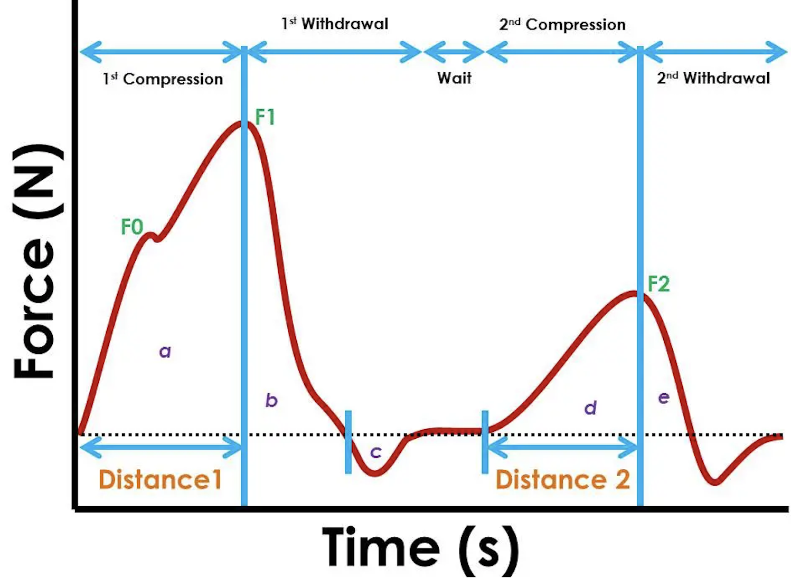

<style>
details {
    border: 1px solid;
    border-radius: 10px;
    padding: .1em .5em 0;
    text-align: left;
}
</style>

---

```{r global_setting, echo = FALSE, message = FALSE, warning = FALSE}
library(knitr)

opts_chunk$set(
  message = FALSE,
  warning = FALSE,
  comment = NA,
  echo = T
)
# Sys.setenv(
#   "RETICULATE_PYTHON" = "C:/Anaconda_Python_3/python.exe"
# )
```

<details>
```{r load_packages, echo=T}
#| label: setup
#| warning: false
#| message: false

library(tidyverse)
library(readxl)
library(summarytools)
library(pracma)
library(ggplot2)
library(fmsb)
library(scales)
library(plotly)
library(knitr)
```
</details>


## Introduction 
  There is a growing demand on plant-based meat analogs due to ethical, environmental and health concerns associated associated with the production of real meat and seafood. Meat and seafood analogs should mimic the desirable appearance, texture, and flavor of the real versions. In this study, we investigated on the texture of animal meat and lab made analogs, especially on their texture profile of adipose tissue(know as fat meat). 
  
  In this data, I have 5 samples. Control is beef fat.Sample 1-4 composed of different plant-based ingredients such as soybean oil, coconut oil, soybean protein and agar to combine them into a emulsion or gel that looks similar as fat meat under microscope. However, they still have huge differences on the macro texture. 
  
  Texture profile analysis mimics motion and force in human oral cavity. the measurement including two times of compression and raw data including time and corresponding time. From this data set, many other parameters can be calculated from the graph. The automatic calculation sometimes can be confusing and messy data have to be processed by excels and individual calculations.  
  
  Parameter including hardness, adhesiveness, resilience, cohesion and chewiness. The definition and calculation will be introduced in below section. 

  In this report, the raw data of texture profile analysis will be tidied and calculated.  The 5 parameter data will be calculated either from raw data or graph and will be visualized. Interpret of comparison in different samples will be performed. Using R may provide an efficient way to process the raw data with better visualization compare to traditional excel plotting and calculation. 

## Data 
  Raw TPA data is presented as time versus force. By plotting this graph, further texture parameters can be done by calculation. 

### tidy data

In this section, the raw data was reded in, pivoted and transformed into a new table as previewed below.

```{r read in and pivot}
#read in data.
# data1 = Texture Profile analysis of 5 samples including data of each time and force
# the cell_limits c=(upper left cell), c=(lower right cell)
data1<- read_excel("_data/final_data.xlsx",
                   sheet="TPAraw",
                  range = cell_limits(c(3,1),c(NA,10)),
              col_names = c("control0time","control0force","S10time","S10force","S20time","S20force","S30time","S30force","S40time","S40force"))

#generate a row number which will help locate data below
data1<-mutate(data1, row_num = seq.int(nrow(data1)))
                               
#converting character data into numeric
invisible(lapply(data1, as.numeric))

#pivot data into 4 variables
data2<-data1%>% pivot_longer(cols = c(control0force,S10force, S20force, S30force,S40force),
                             names_to = "sampleforce",
                             values_to = "force1")%>%
  separate(sampleforce, into = c("sample", "type"), sep = "0")

#extract columns needed and form a clean data frame
TDdata<- data.frame(time = data2$control0time,
                    force1 = data2$force1,
                    sample = data2$sample,
                    row_num = data2$row_num)
#preview of tidy data
head(TDdata)


#result_df = TDdata%>%
 # group_by(sample)%>%
 # arrange(time + sample)%>%
 # mutate(force_T1 = lead(force1))%>%
  
#filter(force1>0)%>%
 #filter(force_T1 <0)%>%print()
#df_1 = result_df %>% filter(sample == "control")
#df_2 = result_df %>% filter(sample == "S1")
#df_3 = result_df %>% filter(sample == "S2")
#df_4 = result_df %>% filter(sample == "S3")
#df_5 = result_df %>% filter(sample == "S4")

```

</details>


### Calculation

  Below is a sample graph of how raw data plotted out as time VS force looks like.
```{r}
# In this section, other parameter described above will be calculated
# Below includes a sample graph

```
  In the texture profile analysis, the highest point of first peak represents the hardness of the sample.The F1 force is defined as hardness of sample. In below block, a function is written to filter out the maximum force of one sample.  Below table in force column present the highest peak in each sample as the hardness.
    
#### find hardness F1
```{r}
# Hardness = F1
# group by sample and filter the sample you want to calculate
#calculate the cumulative area by time and force in each row, this data will used in later section
#slice out the maximum force
#control F1#S1 F1
f1func<-function(x) {
  return( TDdata%>%group_by(sample)%>%
            filter(sample == x)%>%
  mutate(area1=cumtrapz(time,force1))%>%
  slice_max(force1))
}

df1<-f1func('control')
df2<-f1func('S1')
df3<-f1func('S2')
df4<-f1func('S3')
df5<-f1func('S4')

#merge sliced samples into a table
mergefunc<-function(a,b,c,d,e){
  return(a %>%full_join(b,by = c("time", "force1", "sample", "row_num", "area1"))%>%
  full_join(c,by = c("time", "force1", "sample", "row_num", "area1"))%>% 
  full_join(d,by = c("time", "force1", "sample", "row_num", "area1"))%>% 
  full_join(e,by = c("time", "force1", "sample", "row_num", "area1")))
}
F1<-mergefunc(df1,df2,df3,df4,df5)%>%print()

#TRY <- function(control,max_time,time){
#  return(TDdata%>%group_by(sample)%>%
#  filter(sample = 'control')%>%
#  mutate(area2 = cumtrapz(time,force1))%>%
 # mutate(force_t1 =lead(force1)))%>%
  #  F1%>%select(force1, sample ,time) %>%
# rename(max_time = time) %>%
 #right_join(TDdata)%>%
  # filter(time>max_time)%>%
  #filter(force1 > 0)%>%
  #filter(force_t1<0)
  
#} 
#TRY(control, max_time, time)
```

Resilience is defined as area b/area and can be understand as how much sample regain after first compression. And calculated as area b/area a.
Therefore, the next trunk finds out the endpoint of first peak. the cumulative area from end of first peak minus cumulative area of the maximum force(calculated above) will be the area b.

#### find area b    
```{r}
#function to find the endpoint of peak 1 is wroted as finding the first time point after F1 that cooresponding force cross 0. 
#lead function align the force in next time point, therefore, the first point where force+1 is negative, and force is positive, implies the first point cross 0, which is the first peak end point. 

#endpoint of first peak
endfunc<-function(x, y){
  return(TDdata%>%group_by(sample)%>%
  filter(sample == x)%>%
  mutate(area2 = cumtrapz(time,force1))%>%
  filter(row_num > y)%>%
  mutate(force_t1 =lead(force1))%>%
  filter(force1 > 0)%>%
  filter(force_t1<0)%>%
  slice(1))
}

df6<-endfunc('control', 470)

df7<-endfunc('S1', 227)

df8<-endfunc('S2', 230)
  
df9<-endfunc('S3',424)

df10<-endfunc('S4', 212)

#merge sliced samples into a table
mergefunc2<-function(a,b,c,d,e){
  return(a %>%full_join(b,by = c("time", "force1", "sample", "row_num","area2","force_t1"))%>%
  full_join(c,by = c("time", "force1", "sample", "row_num","area2","force_t1"))%>% 
  full_join(d,by = c("time", "force1", "sample", "row_num","area2","force_t1"))%>% 
  full_join(e,by = c("time", "force1", "sample", "row_num","area2","force_t1")))
}
END1<-mergefunc2(df6,df7,df8,df9, df10)

#area b is calculated by cumulative area at end point minus cumulative area at F1
areab = F1 %>% full_join(END1,by = c( "sample"))%>%mutate(areab =  area2 -area1)
```
The cohesion stands for How well the product withstands a second deformation relative to its resistance under the first deformation an calculated as area (d+e)/(a+b). Therefore, we still need to find the start and end point of peak 2. 

In this section, similar functions were wrote to finding the function. The data was cutted after endpoint 1 to find the maximum which is the F2.

#### find F2
```{r}
#finding F2 by filtering the sample after the first peak and then slice tha maximum
F2func<-function(x,y){
  return(TDdata%>%group_by(sample)%>%
  filter(sample == x)%>%
   mutate(area1 = cumtrapz(time,force1))%>%
  filter(row_num > y)%>%
  slice_max(force1))
}
df11<-F2func('control', 551)

df12<-F2func('S1', 259)

df13<-F2func('S2', 268)
   
df14<-F2func('S3', 587)
  
df15<-F2func('S4', 320)
  
F2<- mergefunc(df11, df12, df13, df14, df15)
```
The start point of second peak was filtered back to find the cross 0 point. And the end point is also selected by the cross 0 point after F2.

#### find the start point of area d
```{r }
#find the start point of area d
start2<-function(x,y){
  return(TDdata%>%group_by(sample)%>%
  filter(sample == x)%>%
  mutate(area3 = cumtrapz(time,force1))%>%
  filter(row_num < y)%>%
  arrange(desc(row_num))%>%
   mutate(force_t1 =lead(force1))%>%
  filter(force1 > 0)%>%
  filter(force_t1<0)%>%
  slice(1))
}
dfd1<-start2('control', 3408)
dfd2<-start2('S1', 2681)
dfd3<-start2('S2', 2688)
dfd4<-start2('S3', 3270)
dfd5<-start2('S4', 2631)

mergefunc3<-function(a,b,c,d,e){
  return(a %>%full_join(b,by = c("time", "force1", "sample", "row_num","area3","force_t1"))%>%
  full_join(c,by = c("time", "force1", "sample", "row_num","area3","force_t1"))%>% 
  full_join(d,by = c("time", "force1", "sample", "row_num","area3","force_t1"))%>% 
  full_join(e,by = c("time", "force1", "sample", "row_num","area3","force_t1")))
}

start2<-mergefunc3(dfd1, dfd2,dfd3,dfd4,dfd5)
```

#### find the ending point of area e
```{r}
#find the ending point of area e
END2func<-function(x, y){
  return(TDdata%>%group_by(sample)%>%
  filter(sample == x)%>%
  mutate(area4 = cumtrapz(time,force1))%>%  
  filter(row_num >y)%>%
  mutate(force_t1 =lead(force1))%>%
  filter(force1 > 0)%>%
  filter(force_t1<0)%>%
  slice(1))
}
dfd6<-END2func('control',3408)
dfd7<-END2func('S1',2681)
dfd8<-END2func('S2',2688)
dfd9<-END2func('S3',3270)
dfd10<-END2func('S4',2631)

mergefunc4<-function(a,b,c,d,e){
  return(a %>%full_join(b,by = c("time", "force1", "sample", "row_num","area4","force_t1"))%>%
  full_join(c,by = c("time", "force1", "sample", "row_num","area4","force_t1"))%>% 
  full_join(d,by = c("time", "force1", "sample", "row_num","area4","force_t1"))%>% 
  full_join(e,by = c("time", "force1", "sample", "row_num","area4","force_t1")))
}

END2<-mergefunc4(dfd6,dfd7,dfd8,dfd9,dfd10)

areae = F2 %>% full_join(END2,by = c( "sample"))%>%mutate(areae =  area4 -area1)
aread = F2 %>% full_join(start2,by = c( "sample"))%>%mutate(aread =  area1 -area3)
```

 Springiness is defined as how a product physically springs back at the second compression.
    
Therefore, the critical point we need to find out from the data is the coordinate of F1, the time where area b ends, F2, and where the second peak starts and ends. After obtaining these data, the calculation can be performed.
    
#### combine all calculated value into a data frame for visualization
```{r}
# all value calculated above are sorted into a new table
# Gumminess = Hardness*cohesion
# Chewiness = Gumminess * Springiness

parameters<- data.frame(sample_name = F1$sample,
                        hardness = F1$force1,
                       resilience = c(areab$area2-areab$area1),
                       cohesion = c((aread$aread +areae$areae) / (F1$area1 +areab$areab)),
                        springiness = c((F2$time-start2$time)/F1$time))
parameters<-parameters%>%mutate(chewiness = parameters$hardness * parameters$cohesion)%>%print()

```

## Visualizition
In texture analysis, comparing the values sometimes can be difficult to interpret the data. By visualizing, we can easily compare the single parameters in each sample and analysis how the material brings the strength and weakness separately. We can also compare the overall similarity of each sample to the control ro select a good candidate to continue research on. 

### overview of raw data
Below is an overview of all five samples. As we can see, all the parameters were calculated from this graph. 
* Put your cursor on graph to see data points
```{r}
p_force = ggplot(data = TDdata) + 
  geom_line(mapping = aes(x = time, y = force1, color = sample)) +
  labs(title = "force v.s. time")
p_force %>% ggplotly()
```

### hardness

All the parameters was plotted in bar chart first to compare each single parameter individually. This helps understand the specific strength of each material. 
Control which is the beef sample shows good hardness implies the inner structure of beef provide a good support to the over all material. The lab created samples we can see that emulsion samples(S1 and S3) are less hard than gelled samples(S2 and S4) while solid coconut oil under room temperature(S3 and S4) are better than liquid soybean oil(S1 and S2)
```{r}
#bar chart need to include stat='identity‘ which is basically telling ggplot2 you will provide the y-values for the barplot, rather than counting the aggregate number of rows for each x value, which is the default stat=count
ggplot(parameters, aes(x= sample_name, y= hardness, fill = hardness)) +
    geom_bar(stat='identity',colour = 'black') + 
  scale_y_log10() +
  labs(title = 'Hardness')+ 
  scale_color_gradient(low = "royalblue", high = "steelblue")
```
### resilience
Resilience is how much the sample bounce back from the first compression. Still, the control sample raise most. And the soybean gelled emulsion (S3) remains highest. This indicates the liquid oil gives the best recovery to the gelling agent.
```{r}

ggplot(parameters, aes(x= sample_name, y= resilience,fill = resilience)) +
    geom_bar(stat='identity',colour = 'black') + scale_y_log10()+ labs(title = 'Resilience')+ scale_fill_gradient(low = "hotpink3", high = "lightpink")
```
### cohesion
The cohesion measure how the sample stand at second compression, which can be understand as how much hardness remains in second compression. Some brittle sample may broke during this time. From the graph we can easily tell, emulsion samples (S1S3) have relative high cohesion under second compress. 
```{r}
ggplot(parameters, aes(x= sample_name, y= cohesion, fill = cohesion)) +
    geom_bar(stat='identity',colour = 'black') + labs(title = 'Cohesion') + scale_fill_gradient(low = "turquoise4", high = "steelblue1") 

```
### spinginess
The springiness indicate the relative time sample bounce back. There was no significant differenceb between each samples. 
```{r}
ggplot(parameters, aes(x= sample_name, y= springiness, fill = springiness)) +
    geom_bar(stat='identity',colour = 'black')  +
  labs(title = 'Springiness')+ 
  scale_fill_gradient(low = "cadetblue4", high = "cadetblue1")
```
### chewiness
The chewiness expresses the overall behavior of second compression. Here we can see, our control have the relatively high chewiness while samples are gradually gaining chewiness by adding factors such as solid oil and gelling agent. 
```{r}
ggplot(parameters, aes(x= sample_name, y= chewiness, fill = chewiness)) +
    geom_bar(stat='identity',colour = 'black') +  scale_y_log10 ()+ labs(title = 'chewiness')+ scale_fill_gradient(low = "mediumorchid4", high = "plum")
```
### overall comparison
The radar chart gives a better idea of overall balance overall samples. From the radar chart, we can easily understandthe control still have strength over power all lab-made samples, especially when some parameters were plotted in log scale. However, between samples, we can also differenciate that overall S3 and S4 have a similar area than S1 and S2. This indicates the solid fat contributes more to the fat structure instead of the gelling agent (S3,S4 is overall better than S1,S2). Also looking at S1 and S2, gelling agent provide much improvement  while did not work in S3 and S4. The solid oil somehow restricted the impovement of gelling agent. Overall, S3 and S4 performed best and overall close the character of control. 
```{r}
max<-c('max',25000, 4000, 1,1,15000)
min<-c('min',10,10,0,0.5,10)
parameters1<-rbind(c = min, c=max, parameters, deparse.level = 0)
parameter2<- transform(parameters1, 
          hardness = as.numeric(hardness),
          resilience = as.numeric(resilience),
          cohesion = as.numeric(cohesion),
          springiness = as.numeric(springiness),
          chewiness = as.numeric(chewiness))

parameters3<-parameter2%>%
  mutate(hardnesslog = log10(hardness))%>%
  mutate(chewinesslog = log10(chewiness))%>%
  mutate(resiliencelog = log10(resilience))
parameters3<-parameters3[-c(1:3,6)]
  radarchart(parameters3,maxmin = FALSE,cglwd = 0.5,
             pcol  = c("white","white","blue","pink4","orchid","turquoise3","yellow"),
             plty = 1,palcex = 5,
              pfcol =  scales::alpha(c("white","white","blue","pink4","orchid","turquoise3","yellow"),0.2))
            
    legend(x = "right",
                    legend = c("control","S1","S2","S3","S4") ,
           fill = c("blue","pink4","orchid","turquoise3","gold")
                    )
```


## Reflection

### Why I choose this project

In this project, I selected a measurement data that we used daily in our lab. I want to chose this data because the machine can calculate the value, however sometime with mistakes. In this case, we have to import the data into excel, plot it, find value we need among thousands of data point and then calculate. This process is boring and redunant. By learning r, I found it might be a food idea that I can find a easier way to calculated all this value automatically to avoid human labor. And by the time this programming works, the future data can be imported, organized and visualized automatically which can save much time. Therefore, I decided to work on this project. 

### Difficultes I met

By looking at others projects and examples in the class, I found most of them are aiming at visualization and analysis. However, in my case, the most heavy work was in calculation. The raw data was simple and easy to tidy, however, finding the significant values in this data requires a lot of work. The measurements were human tested samples and there are many interference data points. For example, I want to find the end point of the first peak, where force = 0. However, how would I select the point since the nears point to 0 may be 10, and the next wil be -10, where 0 doesn't actually have a physically point. In this case, I have to using functions to filter and understand where the value I want exactly and not taking in those interference points. 

Also, reducing the redundant steps has also been a difficulty for me to solve. By learning functions, I found that repeated steps can be easily archieved by some package or functions.

  Another thing I have learnt from this class and this project is how to brainstorm the steps that you reach to your final goals. My data looks like a simple data set but considering the interference, it became very difficult to make it accurate. More and more steps were added when i wrote the code and repeat and reduced. So there are tons of effort which may not been present in the code. The learning process was really interesting but tiring, with understanding varies packages and functions. The accumulation will make the future coding much more easier. 
  
### Next step of this project

I haven't optimized the calculation into a best, easiest and shortest steps to calculate all the values which can be done in the future. Another problem I left was indexing of table into tables. This code may be simplified without writing functions and creating much tables. 

Also, there might be a way to cooperate the sample ingredients into data presenting. However, most of my work was done in descriptions. It may also be difficult to visualize or make those numeric to consider about the ingredients.This could also be innovative in presenting scientific research results to help other understand. 


## Conclusion

In conclusion, this project calculated the value of texture analysis profile and visualized the data to compare the samples. This helps us to understant the single parameter and overall strenght and weakness of each sample and find the most close lab-made sample to our control. 

In terms of R, this project help me helps me build up idea of how to approach data in a desired manner and how to make the coding easy and simple. Althought I haven't make it perfect in this project, it is a really great process to learn the idea with processing data. 

## Bibliography

1) Hu, X. and D. J. McClements (2022). "Construction of plant-based adipose tissue using high internal phase emulsions and emulsion gels." Innovative Food Science & Emerging Technologies 78: 103016.
2) Centre for Indutrial, R. (2022). Texture Analysis And Texture Profile Analysis - Rheology Lab.
3)Wickham, H. and G. Grolemund (2016). R for Data Science: Import, Tidy, Transform, Visualize, and Model Data, O'Reilly Media.
	

	

	

 


